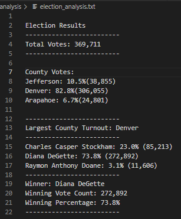
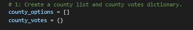
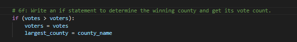

# Election_Analysis

## Overview of Project
In this analysis of a U.S. Congressional precinct in Colorado’s election data, I set out to discover the voter-turnout for each participating county, the percentage of votes per county (in relation to total votes cast) and determined the county with largest voter-turnout.  Additionally, the total votes, number, and percentage of votes per candidate, and the overall winner of the election are defined through the implementation of Python code.

 
## Election Analysis and Outcome

### Election Results

[^IMAGE_A]:

### Analysis of Election Results
- A total of 369,711 votes were cast in the election.
- Votes and percentage of votes per county:
   * Jefferson County: 38,855 votes (10.5%)
   * Denver County: 306,055 votes (82.8%)
   * Arapahoe County: 24,801 votes (3.1%)
-	The county with the largest number of votes is Denver County. 
-	Votes and percentage of votes per candidate:
    * Charles Casper Stockham: 85,213 (23.0%)
    * Diana DeGetta: 272,892 (73.8%)
    * Raymon Anthony Doane: 11,606 (3.1%)
- Candidate Diana DeGetta won the election with 272,892 votes and 73.8% of votes. 

### Summary of Election Audit

The script successfully Diane DeGetta as the winner of the U.S. Congressional precint. Representative DeGetta won the election by a 47.7% margin and 176,073 votes. Not only does this script make analyzing county elections a breeze, with a few modifications, it can be used in State and local elections as well. If it were a State election, I could add lists and dictionaries [IMAGE_B] to hold values for Districts and Counties per District, add a calculation, and quickly determine the winner of the State election. For local elections, with the required data, I could break down the votes for mayor by adding script to find vote counts and percentages per zip or postal code. 

If a city’s recreational annual budget tightened and officials needed to determine which events, activities, or programs to eliminate, they could hold votes. I could assist with their tough decision by writing a decision statement [IMAGE_C] to determine which event, activity, or program received the least votes. Whichever activity has the least votes is the least popular and the city can use this information to make budget cuts around the needs of their constituents.

[^IMAGE_B]:

[^IMAGE_C]:

